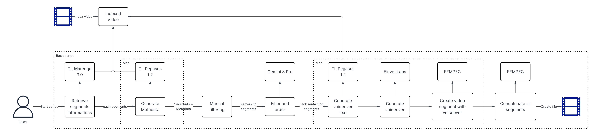

# Commercial Real Estate TwelveLabs PoC

[](https://www.typescriptlang.org/)
[](https://aws.amazon.com/)
[](https://www.terraform.io/)
[](https://reactjs.org/)

A production-ready serverless pipeline that transforms raw real estate walkthrough videos into polished, AI-narrated social media shorts in ~60 seconds using AWS Bedrock AI models and fully managed AWS infrastructure.

## Overview

This project automatically processes real estate property videos through an intelligent pipeline that:

- Extracts and analyzes video segments using Marengo visual embeddings via AWS Bedrock
- Classifies rooms and evaluates visual appeal using Pegasus on AWS Bedrock
- Selects the best ~60 seconds of footage for maximum engagement
- Generates natural voiceover narration tailored to each segment
- Synthesizes professional audio with AWS Polly
- Produces a branded, ready-to-share video with room labels and property information

**Key Features:**

- Fully serverless AWS architecture with Step Functions orchestration
- Event-driven processing with asynchronous callbacks
- Clean architecture pattern with comprehensive test coverage
- Infrastructure as Code with Terraform
- Real-time pipeline status tracking via API Gateway
- Location intelligence with Google Places API integration

## Table of Contents

- [Technology Stack](#technology-stack)
  - [Frontend](#frontend)
  - [Backend & Infrastructure](#backend--infrastructure)
  - [AI & Video Processing](#ai--video-processing)
  - [DevOps](#devops)
- [Architecture](#architecture)
  - [System Architecture](#system-architecture)
  - [Clean Architecture Pattern](#clean-architecture-pattern)
  - [Step Functions Orchestration](#step-functions-orchestration)
- [Pipeline Details](#pipeline-details)
  - [Step-by-Step Processing Flow](#step-by-step-processing-flow)
- [Prerequisites](#prerequisites)
  - [Required Accounts & Keys](#required-accounts--keys)
  - [Required Tools](#required-tools)
  - [AWS Bedrock Setup](#aws-bedrock-setup)
- [Installation](#installation)
- [API Documentation](#api-documentation)
  - [Upload Endpoints](#upload-endpoints)
  - [Pipeline Endpoints](#pipeline-endpoints)
  - [Video Endpoints](#video-endpoints)
  - [Settings Endpoints](#settings-endpoints)
  - [Location Insights Endpoint](#location-insights-endpoint)
- [Location Insights](#location-insights)
  - [Features](#features)
  - [Usage](#usage)
  - [Implementation](#implementation)
  - [Configuration](#configuration)
- [Development](#development)
  - [Local Development](#local-development)
  - [Code Quality](#code-quality)
  - [Testing Strategy](#testing-strategy)
- [License](#license)

## Technology Stack

### Frontend

- **React 18** with TypeScript
- **Vite** for fast development and building
- **TailwindCSS** for modern, responsive UI
- **React Router** for navigation
- **Lucide React** for icons

### Backend & Infrastructure

- **AWS Lambda** (Node.js 20) for serverless compute
- **AWS Step Functions** for workflow orchestration
- **Amazon S3** for video and artifact storage
- **Amazon DynamoDB** for metadata and state management
- **Amazon API Gateway** for RESTful API
- **AWS SDK v3** for AWS service integration
- **TypeScript** for type-safe backend code
- **Vitest** for unit testing (15+ test suites)

### AI & Video Processing

- **Marengo** (via AWS Bedrock) for visual embeddings and scene understanding
- **Pegasus** (via AWS Bedrock) for video content analysis and voiceover generation
- **AWS Bedrock** for AI model hosting
- **AWS Polly** for text-to-speech synthesis
- **FFmpeg** (Lambda Layer) for video processing
- **Google Places API** for property location insights

### DevOps

- **Terraform** for infrastructure as code
- **esbuild** for fast Lambda bundling
- **ESLint** and **Prettier** for code quality

## Architecture

### System Architecture

The pipeline uses a serverless, event-driven architecture orchestrated by AWS Step Functions:



### Clean Architecture Pattern

The backend follows hexagonal architecture principles with clear separation of concerns:

```
commercial-real-estate-twelvelabs-poc/
├── backend/src/
│   ├── handlers/           # Lambda entry points
│   │   ├── api/           # REST endpoints
│   │   ├── marengoCallback/
│   │   ├── startMarengo/
│   │   ├── storeEmbeddings/
│   │   ├── startPegasusAnalysis/
│   │   ├── selectSegments/
│   │   ├── startPegasusVoiceover/
│   │   ├── synthesizeAudio/
│   │   └── processVideo/
│   ├── useCases/          # Business logic
│   ├── infrastructure/    # AWS service implementations
│   ├── ports/             # Interface definitions
│   ├── models/            # Domain entities
│   └── shared/            # Utilities, prompts, types, errors
├── frontend/src/
│   ├── components/        # React UI components
│   ├── hooks/             # Custom React hooks
│   ├── services/          # API client
│   └── types/             # TypeScript types
└── terraform/
    ├── *.tf               # Infrastructure definitions
    ├── state-machine.asl.json
    └── layers/            # Lambda layers
```

**Key architectural components:**

- **Ports**: Define interfaces for external dependencies (e.g., `EmbeddingGenerator`, `SegmentSelector`, `TextToSpeech`)
- **Infrastructure**: Concrete implementations of ports using AWS services
- **Use Cases**: Orchestrate business logic without external service details
- **Handlers**: Thin adapters that translate AWS events to use case calls

### Step Functions Orchestration

The pipeline workflow is defined as a state machine in [`terraform/state-machine.asl.json`](terraform/state-machine.asl.json) with the following key features:

- **Async callback pattern** using `waitForTaskToken` for Marengo embedding processing
- **Parallel execution** via Map states for analyzing up to 5 video segments concurrently
- **Sequential processing** for voiceover generation to maintain narrative flow
- **Smart timeouts**: 30 minutes for embedding, 15 minutes for analysis, 5 minutes for voiceover
- **Error handling** with conditional logic for edge cases (no valid segments, processing failures)

## Pipeline Details

### Step-by-Step Processing Flow

#### 1. Video Upload & Initialization

- Frontend requests presigned S3 URL from API Gateway
- User uploads video directly to S3
- Frontend confirms upload, creating video record in DynamoDB
- User starts pipeline with optional parameters (voiceId, agencyName, streetAddress)

#### 2. Start Marengo Embedding (`StartMarengoEmbedding` State)

- Lambda invokes Marengo model on AWS Bedrock using `StartAsyncInvoke` API
- Marengo processes video in background, generating visual embeddings
- Step Function waits for callback using `waitForTaskToken` pattern
- Bedrock writes output to S3 at `embeddings/{videoId}/output.json`
- EventBridge rule monitors S3 bucket for object creation events
- S3 event triggers `MarengoCallback` Lambda via EventBridge
- Callback Lambda retrieves task token from DynamoDB and resumes state machine
- Timeout: 30 minutes

#### 3. Store Embeddings (`StoreEmbeddings` State)

- Lambda fetches Marengo output from S3
- Filters for `clip` scope embeddings only
- Parses embedding segments with timestamps
- Stores embeddings in S3 at `embeddings/{vectorIndexName}/{videoId}.json`
- Outputs array of segments to state machine

#### 4. Analyze Segments (`AnalyzeSegmentsMap` State)

- Map state processes segments in parallel (max 5 concurrent)
- For each segment:
  - `StartPegasusAnalysis` Lambda invokes Pegasus on Bedrock synchronously
  - Pegasus analyzes visual content for:
    - Room type (Exterior, Kitchen, Living Room, Bedroom, etc.)
    - Appeal score (0-10)
    - Hero shot potential
    - Transition/dead shot detection
  - Uses structured JSON output with schema validation
  - Returns result immediately to Step Functions
- Timeout per segment: 15 minutes

#### 5. Select Segments (`SelectSegments` State)

- Lambda consolidates all analysis results
- Filters out low-quality segments (appealScore ≤ 0 or transition-only)
- Calls Amazon Nova Pro on Bedrock with structured prompt
- AI selects ~60 seconds (50-70s acceptable) of best footage
- Selection criteria:
  - High appeal scores
  - Visual variety
  - Natural house tour flow (exterior → entry → living → kitchen → bedrooms → strong ending)
  - Chronological order preference
- Outputs selected segments with start/end timestamps

#### 6. Generate Voiceovers (`GenerateVoiceoverMap` State)

- Map state processes selected segments sequentially (MaxConcurrency: 1)
- For each segment:
  - `StartPegasusVoiceover` Lambda calls Pegasus synchronously with voiceover prompt
  - Pegasus generates one natural sentence describing the space
  - Maintains narrative context from previous segments
  - Word count constrained by segment duration (~2.5 words/second)
  - Returns result immediately to Step Functions
- Timeout per segment: 5 minutes

#### 7. Synthesize Audio (`SynthesizeAudio` State)

- Lambda receives all segments with voiceover text
- Calls AWS Polly for each narration sentence
- Generates MP3 audio files
- Stores audio in S3
- Attaches audio S3 URIs to segment metadata

#### 8. Process Video (`ProcessVideo` State)

- Lambda downloads source video from S3
- For each selected segment:
  - Cuts video using FFmpeg with precise timestamps
  - Overlays room label text (e.g., "KITCHEN VIEW")
  - Overlays agency name and street address on first segment (uses random defaults if not provided)
  - Merges voiceover audio with video
  - Uses `-shortest` flag to prevent audio overrun
- Creates concat demuxer file listing all segments
- Concatenates segments into single MP4
- Applies faststart flag for web streaming
- Uploads final video to S3 at `{videoId}/output/final.mp4`

**FFmpeg Details:**

- Uses FFmpeg from Lambda Layer at `/opt/bin/ffmpeg`
- Font file: `/opt/fonts/DejaVuSans-Bold.ttf`
- Text overlay with drawtext filter
- H.264 video codec, AAC audio codec
- Resolution preserved from source

## Prerequisites

Before deploying this project, ensure you have:

### Required Accounts & Keys

- **AWS Account** with permissions for:
  - Lambda, Step Functions, S3, DynamoDB, API Gateway
  - AWS Bedrock (with Marengo and Pegasus model access enabled in us-east-1)
  - AWS Polly
  - IAM role creation
- **Google Cloud Account** (optional, for location insights)
  - Places API enabled
  - API key for Places API

### Required Tools

- **Terraform** >= 1.0
- **Node.js** >= 20.x
- **npm** or **pnpm**
- **AWS CLI** configured with appropriate credentials

### AWS Bedrock Setup

Ensure AWS Bedrock model access is enabled:

1. Navigate to AWS Bedrock console in `us-east-1` region
2. Request access to both Marengo and Pegasus models (if not already enabled)
3. Wait for access approval (typically instant for most accounts)

## Installation

### 1. Clone Repository

```bash
git clone <repository-url>
cd commercial-real-estate-twelvelabs-poc
```

### 2. Install Dependencies

```bash
cd backend
npm install

cd ../frontend
npm install
```

### 3. Build FFmpeg Lambda Layer

The pipeline requires FFmpeg for video processing. See [`terraform/layers/README.md`](terraform/layers/README.md) for detailed instructions.

```bash
cd ../terraform/layers
./build-ffmpeg-layer.sh
```

This downloads the latest static FFmpeg build with drawtext support and creates `ffmpeg-layer.zip`.

### 4. Configure Terraform

Create `terraform/terraform.tfvars`:

```bash
cd ..
cp terraform.tfvars.example terraform.tfvars
```

Edit `terraform.tfvars` with your values:

```hcl
environment = "dev"
owner       = "Your Name"
```

From [`terraform/variables.tf`](terraform/variables.tf):

- `environment` (required) - Environment name (dev, staging, prod)
- `owner` (required) - Owner of resources for tagging
- `project_name` (optional) - Project name prefix (default: "cbre-pipeline")

### 5. Deploy Infrastructure

Create an S3 bucket for Terraform state:

```bash
aws s3 mb s3://your-terraform-state-bucket
```

Initialize Terraform (first time only):

```bash
terraform init
```

Build backend and deploy:

```bash
cd ../backend
npm run deploy
```

This command builds the Lambda functions with esbuild and runs `terraform apply`.

### 6. Configure Frontend

Get the API endpoint from Terraform outputs:

```bash
cd ../terraform
terraform output api_endpoint
```

Create `frontend/.env`:

```bash
cd ../frontend
echo "VITE_API_BASE_URL=<your-api-gateway-endpoint>" > .env
```

### 7. Start Frontend Development Server

```bash
npm run dev
```

Access the application at `http://localhost:5173`

## API Documentation

The API Gateway exposes the following RESTful endpoints:

### Upload Endpoints

#### Get Presigned Upload URL

```http
POST /upload/presigned-url
Content-Type: application/json

{
  "filename": "property-tour.mp4",
  "contentType": "video/mp4"
}
```

**Response:**

```json
{
  "videoId": "uuid-v4",
  "uploadUrl": "https://s3.amazonaws.com/...",
  "s3Uri": "s3://bucket/uploads/uuid/source.mp4"
}
```

#### Confirm Upload

```http
POST /upload/confirm
Content-Type: application/json

{
  "videoId": "uuid-v4",
  "filename": "property-tour.mp4",
  "s3Uri": "s3://bucket/uploads/uuid/source.mp4"
}
```

**Response:**

```json
{
  "id": "uuid-v4",
  "filename": "property-tour.mp4",
  "s3Uri": "s3://bucket/uploads/uuid/source.mp4",
  "size": 52428800,
  "status": "ready",
  "createdAt": "2026-01-29T12:00:00.000Z"
}
```

### Pipeline Endpoints

#### Start Pipeline

```http
POST /pipeline/start
Content-Type: application/json

{
  "videoId": "uuid-v4",
  "voiceId": "Joanna",
  "agencyName": "Skyline Estates",
  "streetAddress": "123 Main St"
}
```

**Response:**

```json
{
  "executionId": "arn:aws:states:us-east-1:...",
  "videoId": "uuid-v4",
  "status": "RUNNING"
}
```

#### Get Pipeline Status

```http
GET /videos/{videoId}/status?executionId=<executionArn>
```

**Response:**

```json
{
  "status": "RUNNING",
  "steps": [
    {
      "id": "retrieve",
      "name": "Retrieve Marengo segments",
      "status": "complete"
    },
    {
      "id": "annotate",
      "name": "Annotate with Pegasus",
      "status": "running",
      "progress": 65,
      "mapProgress": {
        "total": 20,
        "succeeded": 13,
        "inProgress": 2,
        "queued": 5,
        "failed": 0
      }
    }
  ]
}
```

### Video Endpoints

#### List Videos

```http
GET /videos
```

**Response:**

```json
[
  {
    "id": "uuid-v4",
    "filename": "property-tour.mp4",
    "status": "ready",
    "createdAt": "2026-01-29T12:00:00.000Z",
    "size": 52428800
  }
]
```

#### Get Video Details

```http
GET /videos/{videoId}
```

**Response:**

```json
{
  "id": "uuid-v4",
  "filename": "property-tour.mp4",
  "s3Uri": "s3://bucket/uploads/uuid/source.mp4",
  "size": 52428800,
  "status": "ready",
  "createdAt": "2026-01-29T12:00:00.000Z",
  "duration": 180.5
}
```

#### Get Output Video

```http
GET /output/{videoId}
```

**Response:**

```json
{
  "videoId": "uuid-v4",
  "downloadUrl": "https://s3.amazonaws.com/...?X-Amz-..."
}
```

### Settings Endpoints

#### List Available Voices

```http
GET /voices
```

**Response:**

```json
[
  {
    "id": "Joanna",
    "name": "Joanna",
    "gender": "Female",
    "accent": "US English"
  },
  {
    "id": "Matthew",
    "name": "Matthew",
    "gender": "Male",
    "accent": "US English"
  }
]
```

### Location Insights Endpoint

#### Get Property Insights

```http
POST /insights
Content-Type: application/json
x-gemini-key: your-google-api-key

{
  "address": "123 Main St, Boston, MA"
}
```

**Response:**

```json
{
  "address": "123 Main St, Boston, MA 02101, USA",
  "coordinates": {
    "lat": 42.3601,
    "lng": -71.0589
  },
  "walkScore": 95,
  "walkLabel": "Highly walkable",
  "transitScore": 88,
  "transitLabel": "Very good transit",
  "bikeScore": 75,
  "bikeLabel": "Very bikeable",
  "schools": [
    {
      "name": "Boston Latin School",
      "rating": 4.5,
      "distance": {
        "km": 0.8,
        "mi": 0.5
      }
    }
  ]
}
```

## Location Insights

The pipeline includes a location intelligence feature powered by Google Places API. This provides property buyers with contextual information about the neighborhood.

### Features

- **School Proximity**: Nearby schools with ratings and distances (km and mi)
- **Walkability Score**: Pedestrian-friendly rating based on nearby amenities (supermarkets, restaurants, cafes, etc.)
- **Transit Accessibility**: Public transportation score based on nearby transit stations
- **Bike Score**: Cycling-friendly rating based on parks and bike infrastructure

### Usage

From the frontend, enter a property address to get instant insights:

```javascript
const response = await fetch(`${API_URL}/insights`, {
  method: 'POST',
  headers: {
    'Content-Type': 'application/json',
    'x-gemini-key': googleApiKey,
  },
  body: JSON.stringify({ address }),
});
const insights = await response.json();
```

### Implementation

Location insights are provided by [`backend/src/handlers/api/getInsights.ts`](backend/src/handlers/api/getInsights.ts) which:

1. Receives Google API key from request header `x-gemini-key`
2. Geocodes the address using Google Geocoding API
3. Searches for nearby schools, transit stations, and amenities within configurable radii
4. Calculates walk score based on POI density (supermarkets, restaurants, cafes, shopping, pharmacies)
5. Calculates transit score based on nearby bus/train/subway stations
6. Calculates bike score based on parks and bike infrastructure
7. Returns top 3 nearby schools sorted by rating with distances in both km and mi
8. Returns structured JSON response with scores and descriptive labels

### Configuration

The Google Places API key must be provided by the client in the request header:

```http
x-gemini-key: your-google-api-key
```

The frontend stores API keys in browser localStorage and automatically includes them in requests. Configure your API key in the Settings page of the application.

## Development

### Local Development

#### Backend

```bash
cd backend
npm install
npm run test
npm run test:watch
npm run test:coverage
```

The backend uses Vitest for testing with 15 test suites covering:

- Use cases (business logic)
- Infrastructure services (AWS integrations)
- Handlers (Lambda entry points)

#### Frontend

```bash
cd frontend
npm install
npm run dev
```

Frontend runs on `http://localhost:5173` with hot module replacement.

### Code Quality

#### Linting

```bash
cd backend
npm run lint

cd ../frontend
npm run lint
```

#### Formatting

```bash
cd backend
npm run format

cd ../frontend
npm run format
```

### Testing Strategy

The backend follows test-driven development with:

- **Unit tests** for use cases and domain logic
- **Integration tests** for infrastructure services (mocked AWS calls)
- **Handler tests** for Lambda entry points

Example test files:

- [`backend/src/useCases/selectSegments/selectSegments.test.ts`](backend/src/useCases/selectSegments/selectSegments.test.ts)
- [`backend/src/infrastructure/AIServices/AIServices.test.ts`](backend/src/infrastructure/AIServices/AIServices.test.ts)
- [`backend/src/handlers/processVideo/processVideo.test.ts`](backend/src/handlers/processVideo/processVideo.test.ts)

## License

This project does not currently have a license file. Please contact the repository owner for usage permissions.
